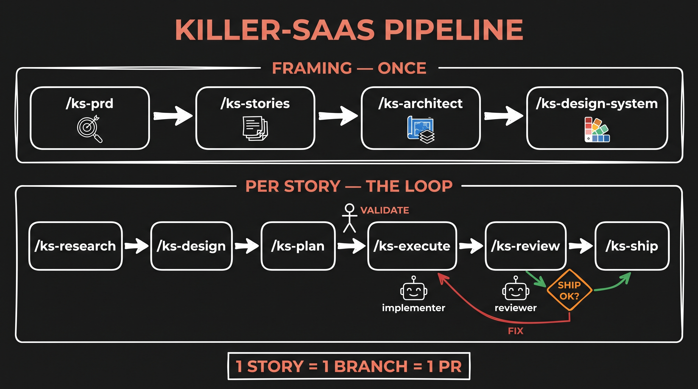
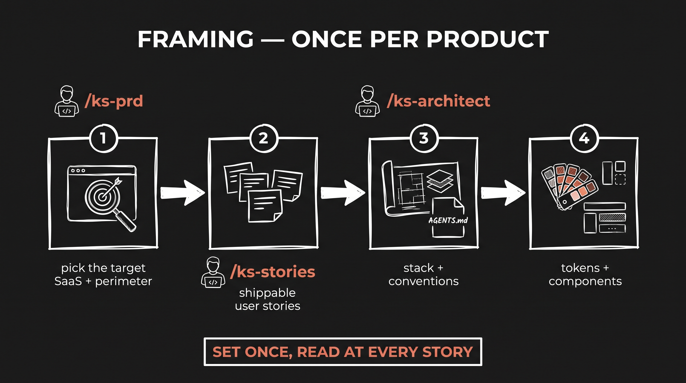
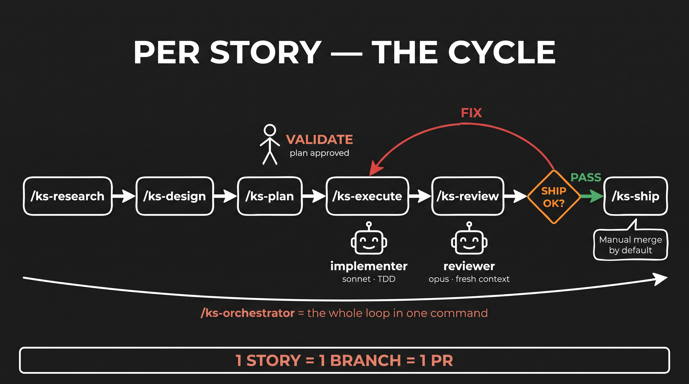

# killer-saas

A complete agentic pipeline to kill a SaaS: pick a target, cut the 20% that matters, rebuild it on your boilerplate, ship it to production.
One method = a suite of commands. One principle = no direct coding.

## Pipeline
PRD → User Stories → Architecture + Design System → then, per story: Research → Design → Plan → Execute → Review → Ship

Full method documentation: [DOC.md](DOC.md)

### Framing — once per product

### Per story — the cycle

## Install

You don't clone this repo into your project: the installer drops its files into whatever directory you run it from.

Quickest — one-liner, from your project's root (the script fetches the repo itself):

    cd your-project
    curl -fsSL https://raw.githubusercontent.com/MikeCodeur/killer-saas/main/install.sh | bash

Prefer to read before you run? Clone the repo somewhere, then run the script from your project's root:

    git clone https://github.com/MikeCodeur/killer-saas.git ~/tools/killer-saas
    cd your-project
    ~/tools/killer-saas/install.sh

### Targets and scopes

One source of truth, one installer, per-tool output. Pick a **target** with `--target`, in **project** (default) or **global** (`--global`) scope:

    ./install.sh                           # Claude Code, project (default)
    ./install.sh --target codex            # Codex, project → .codex/skills + AGENTS.md
    ./install.sh --target all              # Claude + Codex, project
    ./install.sh --global                  # Claude, global (commands in every repo)
    ./install.sh --global --target codex   # Codex, global → ~/.codex/skills
    ./install.sh --global --target all     # both, global

After a global install, drop the per-project files (templates + rules) in each project:

    ~/.claude/killer-saas/install.sh init                 # Claude
    ~/.claude/killer-saas/install.sh init --target codex  # Codex

`AGENTS.md` (the rules) is shared and read natively by both tools; on Claude a one-line `CLAUDE.md` imports it. The 4 skills are the open `SKILL.md` standard, so they carry over unchanged; the 13 `ks-*` commands are emitted as Codex skills. Gemini CLI is planned next — see the fidelity matrix in [DOC.md](DOC.md).

### Repo-level enforcement (git hooks)

The method's guardrails don't have to depend on a specific tool's permissions. Opt in with `--hooks` to enforce them in **git**, identically for every tool:

    ./install.sh --hooks        # (add to any target)

- **pre-commit** — refuses code on a `feature/<id>` branch without a validated plan (`docs/plans/<id>.md` → `validated: yes`). Docs-only commits always pass.
- **pre-push** — refuses pushing the default branch when a merged story lacks a passed review (`docs/reviews/<id>.md` → `Ship allowed: yes`).

Reversible: `git config --unset core.hooksPath`. On Claude the harness also enforces "no direct coding" via tool permissions; the hooks make the same guarantees hold on Codex (and, later, Gemini) — enforcement lives in the repo, not the tool.

## Update

From your project's root:

    ~/tools/killer-saas/install.sh update              # Claude
    ~/tools/killer-saas/install.sh update --target codex   # Codex
    # or, without a clone:
    curl -fsSL https://raw.githubusercontent.com/MikeCodeur/killer-saas/main/install.sh | bash -s -- update
    # overwrite locally modified templates too:
    curl -fsSL https://raw.githubusercontent.com/MikeCodeur/killer-saas/main/install.sh | bash -s -- update --force

What it does — and doesn't:
- Cleanly replaces the method's tooling, tracked per target in `.ks-manifest` (`.claude/` or `.codex/` — your own commands/skills are never touched, renamed or removed files leave no ghosts).
- Refreshes the templates you haven't modified; a locally modified template is never overwritten (you get a warning instead — add `--force` to overwrite).
- Stamps the installed version in `.ks-version`.
- Never touches `AGENTS.md`: if the method's rules evolved, merge by hand.

## Usage

    /ks-prd <target-saas>
    /ks-stories
    /ks-architect
    /ks-design-system
    # then, per story:
    /ks-research <story>
    /ks-design <story>
    /ks-plan <story>
    /ks-execute <story>
    /ks-review <story>
    /ks-ship <story>

    # or run a story's full cycle (with human checkpoints):
    /ks-orchestrator <story>

    # where does the project stand?
    /ks-status

    # lost? pipeline map (français) :
    /ks-help

On **Codex**, the same steps run as skills (e.g. `ks-prd`, `ks-execute`) — same order, same gates. The git hooks (`--hooks`) enforce the pipeline the same way on both tools.

## Autonomous mode — `/goal`

`/goal` is a native Claude Code command (not a killer-saas one): you state an outcome, it figures out how to reach it — planning the work, spawning parallel agents, and finding the best sequence itself. Point it at the killer-saas commands and it drives the whole backlog for you.

    /goal All user stories planned, reviewed and executed.
    Start a dynamic workflow with multiple parallel agents to implement
    the user stories (find the best sequence).

It reads `docs/stories.md`, respects the dependency order, and fans out `/ks-research → … → /ks-review` across independent stories in parallel — while the method's gates still hold: no execution without a validated plan, no ship past an open critical. Use it to go wide once the framing (PRD, stories, architecture, design system) is done; use the individual `/ks-*` commands when you want to drive one story by hand.
